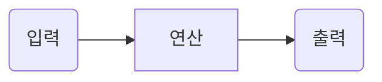
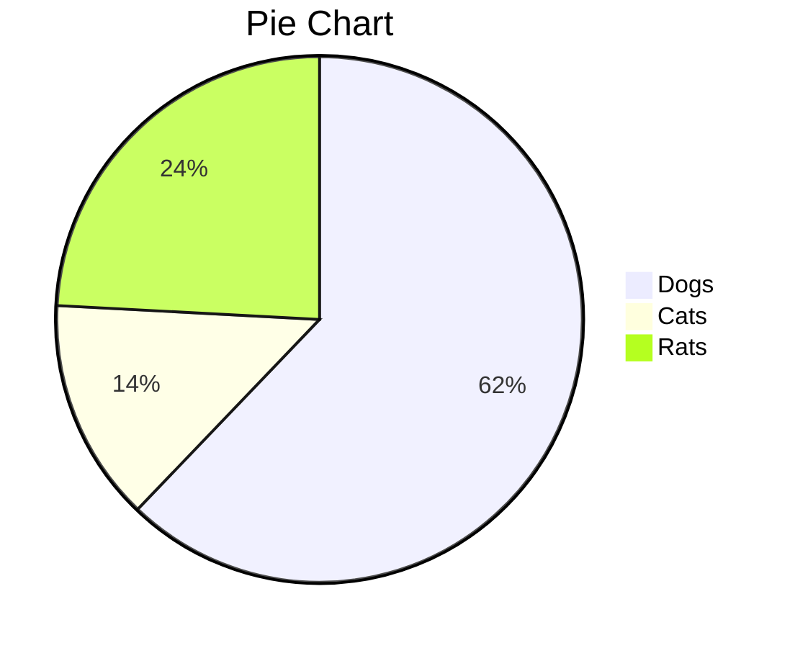

도서 역행자에서 말하는 역행자 7단계의 첫 도입은 '자의식 해체'로 시작한다.
첫 단계에서 말하고자하는 핵심은, '지나친 방어기재를 부수고, 자기자신의 못남을 받아들인 뒤, 개선해라'가 되겠다.
여러 자의식 좀비들의 나쁜 사례를 글을 통해 보여주고 있는 데, 우리 사회에서 매우 쉽게 볼 수 있는 안타까운 모습들이 즐비하다.

자의식 좀비들의 사례를 보며, '그래 정말 한심하게 사는 위선자들이 정말 많지'라고 생각을 했다.
책에서 돈을 누구보다 원하면서 나는 돈 보다 더 높은 가치를 추구해 하는 사람들을 보고 '우아를 떤다'라고 표현한 것이 인상깊었다. 주변은 물론 내 삶에도 이러한 사람들이 얼마나 있었던가, 과거에 나조차 그랬으니 말이다.

이러한 말이 생각난다.

> 내안의 무엇이든 나를 움직이는 원동력으로 삼을 수 있다.
> 출저 : 그대 스스로를 고용하라

저런 위선자들을 보며 한심하다 못해 경멸스럽기 짝이없다. 곁에 있는 것 자체로도 영향을 받을까봐, 괜한 시간과 감정을 소비하며 내 자원을 낭비할까봐, 선을 긋고 철저히 배척한다.

타인을 한심하게 여기고 경멸하는 건 좋은 감정은 아니다.
하지만 위의 책에서 말했듯 이러한 내 감정조차 나를 움직이는 원동력으로 삼을 수 있다고 본다.

그런 사람들까지 내가 사랑이나 책임으로 대해줄 의무는 전혀없다. 나 스스로 더 나아가 우리주변의 사람들을 챙기며 웃고 떠들기에도 부족한 삶이다.

동시에 나는 그러고 있지 않은지 돌아보는 반면교사 거울로 삼으면 되겠다.

자의식 과잉으로 문제를 마주하려고 하지않고 그저 미루고 회피하며 도망치는 자기합리화를 하는 한심한 이들. 원하는 건 많지만 노력은 하기 싫고, 잘 된 사람을 보며 그저 깍아내리기 바쁜 사회악들.

